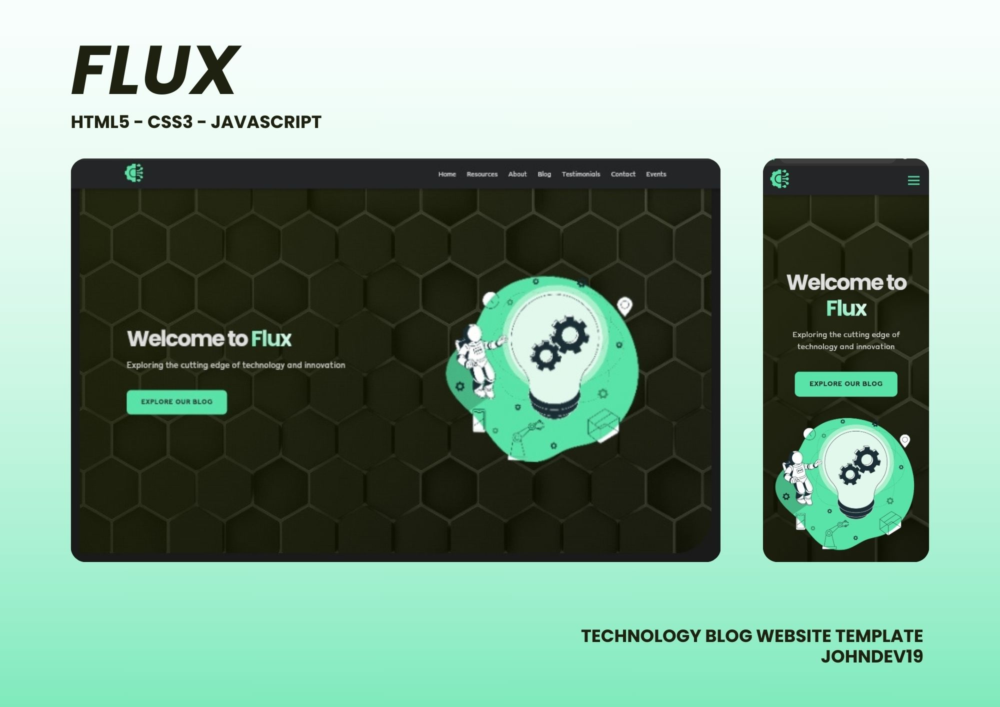
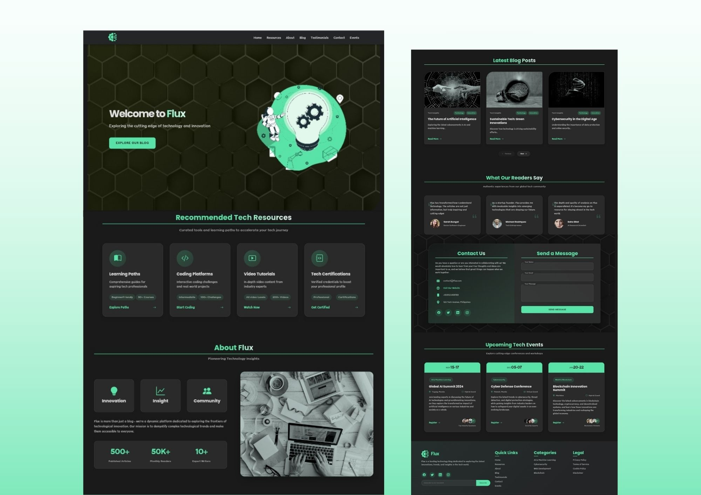

# Flux

Flux is a blogging platform for frontiers of technological stuffs. It serves as a resource hub for providing insights, tutorials and updates on the latest trends in technology.

## Features

- Responsive design for optimal viewing on various devices
- Curated tech resources and learning paths
- Blog section for the latest articles and insights
- Testimonials from readers and industry experts
- Contact form for inquiries and collaborations
- Upcoming tech events section

## Technologies Used

- HTML5
- CSS3
- JavaScript
- Bootstrap Icons
- Responsive Design
- Grid Layout
- Flexbox
- CSS Variables
- CSS Animations

## Contributing

Contributions are welcome! If you have suggestions for improvements or new features, feel free to open an issue or submit a pull request.

## License

This project is licensed under the MIT License. See the [LICENSE](LICENSE) file for more details.

## Author
- JohnDev19
